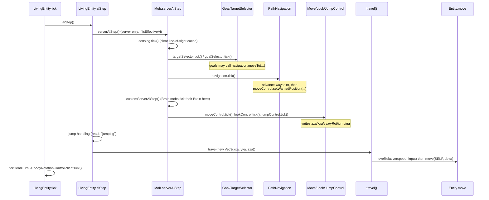

# Vanilla mob AI: the execution side

Reference notes on how a `Mob` actually *moves*, as opposed to how it *decides*. Written against
1.21.1 (line numbers refer to the merged vanilla jar sources). Goals and Brain are the WHAT and
are only covered here where they touch the execution machinery.

## 1. The layer stack

Vanilla splits mob AI into five layers. Each one only talks to the layer below through a small
set of fields, never by calling into it directly. That is why they can be swapped independently.

```
                     WHAT                                     HOW
   +-------------------------------------+   +---------------------------------------+
 5 | GoalSelector / Brain                |   |                                       |
   | "I want to be at (x,y,z)"           |   |                                       |
   +------------------+------------------+   +---------------------------------------+
                      |  navigation.moveTo(path, speed)
                      v
   +-------------------------------------------------------------------------------+
 4 | PathNavigation           route planning + route following                      |
   | owns: Path, PathFinder, NodeEvaluator                                          |
   +------------------+------------------------------------------------------------+
                      |  moveControl.setWantedPosition(x, y, z, speed)
                      v
   +-------------------------------------------------------------------------------+
 3 | MoveControl / LookControl / JumpControl        steering, one waypoint at a time |
   +------------------+------------------------------------------------------------+
                      |  mob.setZza/setXxa/setYya/setSpeed/setYRot/setJumping
                      v
   +-------------------------------------------------------------------------------+
 2 | LivingEntity.aiStep + travel()                 "virtual controller input"       |
   +------------------+------------------------------------------------------------+
                      |  setDeltaMovement(...)
                      v
   +-------------------------------------------------------------------------------+
 1 | Entity.move()                                  collision, friction, gravity     |
   +-------------------------------------------------------------------------------+
```

The key insight: **layers 5-3 never touch position or velocity.** They only write to a handful of
"virtual joystick" fields on the entity. Layer 2 reads that joystick and turns it into velocity;
layer 1 resolves velocity against the world. A mob is driven exactly like a player, except the
input comes from a `MoveControl` instead of a keyboard.

### The joystick fields

| Field | Written by | Meaning |
|---|---|---|
| `zza` | `MoveControl` (via `setZza`, or `setSpeed` indirectly) | forward input, like holding W |
| `xxa` | `MoveControl.strafe` | strafe input, like A/D |
| `yya` | `FlyingMoveControl`, swimming controls | vertical input, only meaningful in water/flight |
| `speed` (`setSpeed`) | `MoveControl` | movement magnitude; also sets `zza` |
| `yRot` | `MoveControl` (body/travel direction) | where the mob is *going* |
| `yHeadRot` / `xRot` | `LookControl` | where the mob is *looking* |
| `yBodyRot` | `BodyRotationControl` | render/aim body yaw, follows the other two |
| `jumping` | `JumpControl` | like holding space |

`Mob.setSpeed` is worth noting: it sets both the attribute-scaled speed *and* `zza`, which is why
a `MoveControl` that calls `setSpeed` alone already produces forward walking.

## 2. The tick pipeline

`ServerLevel` ticks the entity, which lands in `LivingEntity.tick()`. The whole AI system runs
inside one call, in a fixed order, every tick.



Exact source order in `Mob.serverAiStep` (Mob.java:747-786):

```
noActionTime++
sensing.tick()                       // clears the per-tick LOS cache
if ((tickCount + id) % 2 != 0)  ->  targetSelector.tickRunningGoals(false)
                                    goalSelector.tickRunningGoals(false)
else                            ->  targetSelector.tick()
                                    goalSelector.tick()
navigation.tick()
customServerAiStep()                 // Brain mobs hook here
moveControl.tick()
lookControl.tick()
jumpControl.tick()
sendDebugPackets()
```

Three details that matter in practice:

- **Goal re-evaluation runs at 10 Hz, not 20 Hz.** On odd ticks only `tickRunningGoals(false)` runs,
  which ticks *running* goals that opted in via `requiresUpdateEveryTick()`. `canUse` / `canContinueToUse`
  are only re-checked on even ticks. The `+ this.getId()` offset staggers mobs so they do not all
  re-plan on the same tick. Everything below the goal layer (navigation, controls) runs every tick.
- **Navigation ticks before the controls.** So a waypoint advanced this tick is steered towards in
  the same tick, no one-tick lag.
- **`serverAiStep` is `final`.** The extension point is `customServerAiStep()`.

`aiStep` itself (LivingEntity.java:2590-2721) does the joystick-to-physics part:

```
if (isImmobile())        jumping = xxa = zza = 0
else if (isEffectiveAi()) serverAiStep()          // <-- the whole block above
if (jumping && ...)      jumpFromGround() / jumpInLiquid()   // reads JumpControl's output
xxa *= 0.98; zza *= 0.98                                     // input decay
travel(new Vec3(xxa, yya, zza))
```

The `* 0.98` decay is the reason a `MoveControl` that stops writing does not stop the mob dead: the
input bleeds off over a few ticks. Also note `MoveControl.tick()` sets `operation = WAIT` at the top
of the `MOVE_TO` branch, so **a wanted position is consumed exactly once**. If nothing calls
`setWantedPosition` again next tick, the mob coasts and stops. `PathNavigation.tick()` re-issues it
every tick while a path is active, which is what keeps a mob walking.

### Client vs server

| Runs where | What |
|---|---|
| Server only | goals, brain, navigation, MoveControl, LookControl, JumpControl (all inside `serverAiStep`, gated by `isEffectiveAi()`) |
| Both sides | `travel()` / `move()` (client runs it on the interpolated copy), `BodyRotationControl.clientTick()` |

`BodyRotationControl` is misnamed: `clientTick()` is called from `LivingEntity.tick -> Mob.tickHeadTurn`
(Mob.java:390-393), which runs on both sides. It is the only "control" outside `serverAiStep`, and it
runs *after* the AI, reconciling `yBodyRot` against `yHeadRot`/`yRot`:

```
isMoving()?  -> body snaps to travel direction, head is clamped to body
otherwise    -> head turns freely; if the head stays within 15 deg for 10 ticks,
                the body slowly rotates to face it over the next 10 ticks
```

## 3. PathNavigation: plan, then follow

Two distinct jobs live in one class.

### Planning (`createPath` / `moveTo`)

```
goal calls navigation.moveTo(x, y, z, speed)
        |
        +--> createPath(BlockPos, accuracy)
        |       - early out if target set unchanged and current path still alive
        |       - snapshot the world into a PathNavigationRegion
        |         (cube of followRange + regionOffset around the mob; thread-safe copy)
        |       - pathFinder.findPath(region, mob, targets, followRange, accuracy, multiplier)
        |
        +--> moveTo(path, speed)
                - trimPath()      (cauldron fixups; GroundPathNavigation adds sun avoidance)
                - store path, reset stuck timers
```

`PathNavigationRegion` is why pathfinding is safe to touch chunk data: it is a copied view, not the
live level. It is also why path search cost scales with `FOLLOW_RANGE` cubed, and why the region is
built even for a 3-block walk.

### Following (`tick` -> `followThePath`)

```
PathNavigation.tick()
  |- if hasDelayedRecomputation -> recomputePath()   (at most once per 20 ticks)
  |- if !isDone()
  |    |- canUpdatePath()?  -> followThePath()
  |    |     |- maxDistanceToWaypoint = f(bbWidth)   (0.75 - w/2, or w/2 for wide mobs)
  |    |     |- close enough to next node (dx,dz < maxDist and dy < 1)?  -> path.advance()
  |    |     |- else canCutCorner(type) && shouldTargetNextNodeInDirection()? -> path.advance()
  |    |     +- doStuckDetection()
  |    +- else (mid-air for a ground mob) advance if falling straight down onto the node
  |- sendPathFindingPacket (F3+B debug renderer)
  +- moveControl.setWantedPosition(nextPos.x, getGroundY(nextPos), nextPos.z, speedModifier)
```

`canUpdatePath()` is the abstract "am I in my element" check: `GroundPathNavigation` requires
`onGround() || isInLiquid() || isPassenger()`, so a walking mob mid-jump does not advance waypoints.

`shouldTargetNextNodeInDirection` is the corner-cutting heuristic: if the node after next is closer
than the next one, or the next one is within 0.5 blocks, and the two directions point away from each
other (dot < 0), skip ahead. This prevents the visible stutter at path corners.

Two independent failure timers:

- **Stuck check**, every 100 ticks: if the mob moved less than `(speed*100*0.25)^2` in that window,
  set `isStuck` and `stop()`. Goals see this via `navigation.isStuck()`.
- **Node timeout**: per node, budget = `distance / speed * 20` ticks; exceeding 3x that kills the path.

`recomputePath()` is rate-limited to once per 20 ticks and otherwise sets `hasDelayedRecomputation`,
which fires on the next tick past the cooldown. `shouldRecomputePath(pos)` is what block-change
listeners call to invalidate a path when the world changes near it.

## 4. Pathfinder and NodeEvaluator

```
PathFinder.findPath
  nodeEvaluator.prepare(region, mob)          // bind the world snapshot + mob, reset caches
  start = nodeEvaluator.getStart()
  targets = positions.map(nodeEvaluator::getTarget)
  ... A* loop ...
  nodeEvaluator.done()                        // release, clear caches
```

The A* loop itself (PathFinder.java) is textbook, with three vanilla quirks:

1. `h` is multiplied by `1.5F` (the `FUDGING` constant, though inlined) - weighted A*, so paths are
   not optimal but the search is much cheaper.
2. `g = parent.g + distance(parent, node) + node.costMalus`. Costs live **on the node**, not on the
   edge, so any cost that depends on where you came from cannot be expressed in vanilla.
3. Node budget: `maxVisitedNodes * searchDepthMultiplier`, where `maxVisitedNodes` is
   `floor(FOLLOW_RANGE * 16)`. Exceeding it returns the best partial path (`reachesTarget = false`),
   not null. `Path.canReach()` distinguishes the two.

`NodeEvaluator` is the entire world model. It answers three questions:

| Method | Question |
|---|---|
| `getStart()` | which node is the mob standing on |
| `getTarget(x,y,z)` | which node represents the destination |
| `getNeighbors(Node[], node)` | which nodes are reachable from here, and at what malus |

Implementations: `WalkNodeEvaluator` (gravity, step height, doors, fences, danger avoidance),
`FlyNodeEvaluator` (26-way free flight), `SwimNodeEvaluator`, `AmphibiousNodeEvaluator`,
`FrogNodeEvaluator`. Per-mob tuning happens through `Mob.getPathfindingMalus(PathType)`, which every
evaluator consults, so `setPathfindingMalus(PathType.WATER, -1)` makes a mob avoid water without
touching the evaluator.

## 5. MoveControl variants

Base `MoveControl` is a four-state machine:

```
        setWantedPosition()                     strafe()
   WAIT ------------------> MOVE_TO        WAIT ---------> STRAFE
    ^                          |                             |
    |  tick (consumed)         | obstacle detected           | tick (consumed)
    +--------------------------+---> JUMPING ----------------+
                                        ^  |
                                        |  | onGround()
                                        +--+
```

`MOVE_TO` per tick:
1. `yRot = rotlerp(yRot, atan2(dz, dx) - 90, 90)` - turn towards the waypoint, max 90 deg/tick.
2. `setSpeed(speedModifier * MOVEMENT_SPEED)` - which also sets `zza`.
3. Obstacle test: if the waypoint is higher than `maxUpStep` and horizontally close, or the mob is
   inside a non-empty collision shape that is not a door or fence, call `jumpControl.jump()` and
   switch to `JUMPING`.

Note what is *not* there: no acceleration, no turn radius, no lookahead. The mob rotates up to 90
degrees per tick and always moves at full speed along its current facing. That is why vanilla ground
mobs pivot in place. Any smoothness has to come from a custom `MoveControl`.

Notable subclasses:

| Class | What it changes |
|---|---|
| `FlyingMoveControl(mob, maxTurn, hoversInPlace)` | sets `noGravity`, drives `yya` for vertical, uses `FLYING_SPEED` when airborne, pitches towards the waypoint with a `maxTurn` cap |
| `SmoothSwimmingMoveControl` | eased yaw/pitch, speed ramping, actual turn-rate limits. The closest vanilla gets to inertial steering |
| `SlimeMoveControl` / `RabbitMoveControl` | hop-based; movement only happens on jump ticks |
| `PhantomMoveControl`, `GhastMoveControl`, `VexMoveControl` | bypass or partially bypass navigation, steering directly at a target |
| `CamelMoveControl`, `PandaMoveControl`, `FoxMoveControl` | gate `MOVE_TO` behind pose/state (sitting, sleeping, dashing) |

`FlyingMoveControl` is only marginally smarter than the base: it still snaps yaw at 90 deg/tick and
only limits *pitch* by `maxTurn`. Its `yya` output feeds `travel()`'s vertical term.

## 6. LookControl and the three yaws

A mob carries three horizontal angles, and confusing them is the usual source of "my mob's head is
screwed on backwards" bugs.

```
   yRot       - the entity's facing / travel direction.        written by MoveControl
   yHeadRot   - where the head points.                         written by LookControl
   yBodyRot   - render body yaw, and what strafing is relative to.
                                                               written by BodyRotationControl
```

`LookControl.tick()`:
```
resetXRotOnTick()? -> xRot = 0                  // most mobs reset pitch every tick
lookAtCooldown > 0 ?
    yHeadRot = rotateTowards(yHeadRot, wantedYaw, yMaxRotSpeed)     // yMaxRotSpeed = getHeadRotSpeed()
    xRot     = rotateTowards(xRot, wantedPitch, xMaxRotAngle)       // xMaxRotAngle = getMaxHeadXRot()
  : yHeadRot = rotateTowards(yHeadRot, yBodyRot, 10)                // relax to body
clampHeadRotationToBody()   // only while navigating: clamp to +-getMaxHeadYRot()
```

`setLookAt` sets a **2-tick cooldown**, so a goal that calls it every other tick keeps the head
locked on. Once it stops, the head drifts back to the body at 10 deg/tick.

Overridables on `Mob` that tune all of this: `getMaxHeadYRot()` (default 75), `getMaxHeadXRot()`
(default 40), `getHeadRotSpeed()` (default 10).

## 7. Control arbitration: Goal.Flag

This is the one place where the WHAT layer knows about the HOW layer. Each `Goal` declares which
controls it needs:

```java
this.setFlags(EnumSet.of(Goal.Flag.MOVE, Goal.Flag.LOOK));
```

`GoalSelector` keeps `lockedFlags: Map<Flag, WrappedGoal>`. A goal can only start if, for every flag
it wants, the current holder can be replaced by it (`canBeReplacedBy` = strictly lower priority
number). Starting it stops the previous holders. Flags are `MOVE`, `LOOK`, `JUMP`, `TARGET`.

`Mob.updateControlFlags()` (called every 5 ticks) disables flags wholesale when the mob is being
ridden by another mob or is in a boat, which is how a mounted mob stops steering itself.

Two flags never conflict, so a `LOOK`-only goal (e.g. `RandomLookAroundGoal`) coexists with a
`MOVE`-only goal. Declaring flags too broadly is the usual cause of "my goal never runs".

## 8. The Brain equivalent

Brain mobs (villagers, piglins, axolotls, warden, frog, camel) skip `goalSelector` almost entirely
and tick their `Brain` from `customServerAiStep()`. The layer boundary is identical: the Brain does
not touch navigation either. It writes a `WalkTarget` into memory, and one core behavior,
`MoveToTargetSink`, translates memory into navigation calls:

```
MemoryModuleType.WALK_TARGET  --(MoveToTargetSink)-->  navigation.createPath / moveTo
                              <--                      MemoryModuleType.PATH
                                                       MemoryModuleType.CANT_REACH_WALK_TARGET_SINCE
```

`MoveToTargetSink` is worth reading as the reference implementation of "drive navigation correctly":
it repaths when the target moves more than 2 blocks, writes back a `CANT_REACH...` memory when the
path cannot reach, falls back to `DefaultRandomPos.getPosTowards` when no path exists at all, and
applies a random cooldown of up to 40 ticks after a stuck failure so the mob does not spin on an
unreachable target.

## 9. Where to hook in, by symptom

| You want to change | Override / replace |
|---|---|
| which cells are traversable, and their cost | `NodeEvaluator` (via `PathNavigation.createPathFinder`) |
| the search algorithm itself | `PathFinder`, returned from `createPathFinder` |
| when a waypoint counts as reached, stuck rules | `PathNavigation.followThePath` / `doStuckDetection` / `getMaxDistanceToWaypoint` |
| how the mob steers between waypoints | `MoveControl` |
| turn rate, acceleration, banking, inertia | `MoveControl` (nothing else limits turn rate) |
| head/aim behaviour | `LookControl`, `getMaxHeadYRot`, `getHeadRotSpeed` |
| jump strength/timing | `JumpControl`, `LivingEntity.getJumpPower`, `jumpFromGround` |
| gravity, drag, swimming/flying physics | `LivingEntity.travel` |
| avoiding fire/water/etc. per mob | `mob.setPathfindingMalus(PathType, float)` - no subclassing needed |
| decision making | goals / brain |

## 10. Why the test bird overshot, with numbers

Diagnosis of the first in-game run, where the lattice paths were correct but flying them was not.
The setup at the time was stock: `FlyingPathNavigation` + `FlyingMoveControl(this, 20, true)`.

Movement is a first-order system: acceleration is *added* to velocity each tick, drag is
multiplicative. So after input is cut, the remaining travel is `v * d / (1 - d)`. That number is the
whole story.

Two constants dominate and both are easy to miss:

- **Airborne acceleration ignores the FLYING_SPEED attribute.** `getFrictionInfluencedSpeed`
  (LivingEntity.java:2428) returns `getSpeed() * 0.216/friction^3` on the ground but a flat
  `getFlyingSpeed()` = **0.02** in the air. The attribute only reaches physics through `zza`.
- **Vertical drag is 0.98 unless the mob is a `FlyingAnimal`** (LivingEntity.java:2213). That is a
  50-tick time constant against 11 ticks horizontally.

| | accel/tick | drag | terminal | stopping distance |
|---|---|---|---|---|
| TestMob horizontal | 0.0055 | 0.91 | 0.061 b/t | **0.62 blocks** |
| TestMob vertical (not FlyingAnimal) | 0.0056 | 0.98 | 0.28 b/t | **~14 blocks** |
| TestMob vertical (as FlyingAnimal) | 0.0056 | 0.91 | 0.062 b/t | 0.62 blocks |
| Zombie, on the ground | 0.052 | 0.546 | 0.114 b/t | **0.14 blocks** |

Against `followThePath`'s acceptance radius (`0.75 - bbWidth/2` = 0.375 for a 0.75-wide mob, 0.45 for
a zombie):

- zombie: stops in a third of its acceptance radius. Ground friction makes overshoot impossible,
  which is why nobody ever writes braking logic for a vanilla ground mob.
- test bird: 1.7x the acceptance radius horizontally, and vertically it was climbing 4.6x faster
  than it flew forwards and needed a dozen blocks to stop.

On top of the physics, `FlyingMoveControl` is a bang-bang controller: yaw snaps up to 90 deg/tick,
thrust is full until within 0.0005 blocks, and `yya` is `+f1` or `-f1` with no regard for how small
the altitude error is. Nothing in it decelerates on approach.

## 11. What replaced it

The steering layer now lives next to the pathfinder, in `pathfinding/`:

| Class | Replaces | Why |
|---|---|---|
| `BirdMoveControl` | `FlyingMoveControl` | rate-limited yaw, turn-scaled thrust, braking on both axes |
| `BirdLookControl` | `LookControl` | stops pitch from being zeroed after the move control writes it |
| `BirdPathNavigation.followThePath` | vanilla `followThePath` | wider acceptance radius, accept passed waypoints, no corner cutting |
| `BirdFlightConfig` | - | the knobs, same public-static-mutable style as `BirdPathfindingConfig` |

The braking rule is worth restating because it needs no magic constants. At distance `s` with drag
`d`, the fastest you can be going and still arrive is `s * (1 - d) / d`. Compare that to the actual
velocity and scale thrust by the ratio, clamped to 1. Drag is known (0.91, or 0.98 vertically for a
non-`FlyingAnimal`) and velocity is observable, so the flat 0.02 acceleration constant never enters.

Horizontal braking measures the remaining length **of the path**, not the distance to the next
waypoint: intermediate waypoints are flown through, only the end of the path is an arrival.

Three gotchas that this ran into, all of them tick-order or vanilla-default problems:

1. **`LookControl` ticks after `MoveControl`** and `resetXRotOnTick()` defaults to true, so any pitch
   the move control writes is silently zeroed the same tick. Hence `BirdLookControl`.
2. **Nothing clears `MoveControl.operation` back to `WAIT`** except the base implementation
   consuming it. A control that does not consume it must gate on `mob.getNavigation().isDone()`
   instead, which is what `SmoothSwimmingMoveControl` does.
3. **`BodyRotationControl` lags the turn** by several ticks if left alone, so the model reads as
   sliding sideways through an arc. `BirdMoveControl` pins `yBodyRot` to `yRot`.

Still true and still relevant from the original analysis:

- **Costs are node-local in vanilla.** `g = parent.g + distance + node.costMalus`, so a turn cost
  that depends on the parent genuinely cannot live in `costMalus`. `BirdPathFinder`'s `getEdgeCost`
  addition is the minimal correct fix, and invariant #1 in `PATHFINDING_NOTES.md` is a direct
  consequence of that one line.
- **`canUpdatePath()`** must be true for a mob that is never `onGround()`. `FlyingPathNavigation`
  already handles this, so inheriting from it is correct.

## 12. Known issue: the ruler cursor can deadlock (unresolved)

In-game symptom, first caught 2026-07-28: a bird flying a straight, unobstructed path (no turning
involved) went idle mid-path. `BirdMoveControl` was still nominally `MOVE_TO`, but the mob had
stopped translating entirely, sitting short of the drawn target.

### Why: a closed loop with no restoring force

```
PathRuler.advanceCursorTo(mobPos)  -->  cursor
BirdPathNavigation.tick()          -->  carrot = ruler.pointAt(cursor + lookahead)
BirdMoveControl.tick()             -->  thrust towards carrot
mob moves                          -->  new mobPos, feeds back into advanceCursorTo
```

Every step of this is derived from the mob's *own current position*. There is no absolute,
externally-anchored target anywhere in the loop (vanilla aims at the literal next node's fixed
coordinates instead, which is why a vanilla mob that stalls for a tick still gets pulled at the
same real point next tick). If the cursor ever stops advancing here, the carrot freezes with it,
and nothing in the loop can restart it from the outside.

The trap that turns a stall into a permanent one: `BirdMoveControl` still carries vanilla's arrival
epsilon, meant for "wanted position = final destination":

```java
if (dx*dx + dy*dy + dz*dz < MIN_SPEED_SQR) {   // ~0.0005 blocks
    this.coast();
    return;
}
```

Here "wanted position" is the carrot, which should always be ~`BirdFlightConfig.lookahead` blocks
ahead. If the cursor stalls and momentum carries the mob up to that frozen point, thrust snaps to
exactly zero with no taper, position stops changing, and the cursor never gets another chance to
advance (it only moves via `mob position -> projection`). Self-reinforcing, not a one-off glitch.

Leading theory for what stalls the cursor in the first place on a straight run specifically:
`advanceCursorTo`'s 2-block `projectionWindow` skips legs shorter than `1.0E-9` outright
(`legLengthSqr < 1.0E-9 -> continue`). If the lattice ever emits near-duplicate consecutive node
positions and that cluster lands at the edge of the window, there may be nothing left inside the
window to project onto. Not confirmed against real search output yet.

### How it actually gets caught (or doesn't)

Nothing in `BirdPathNavigation`/`PathRuler` detects this itself. It only ever gets cleaned up by
whichever vanilla `PathNavigation` watchdog trips first, and the two behave very differently:

- **100-tick distance check** (`doStuckDetection`, the literal `isStuck`/`stop()` path): compares
  real displacement over the last 100 ticks against a (generous) threshold. Sets `isStuck = true`
  before calling `stop()`, so it's visible after the fact.
- **Per-node timeout** (`timeoutPath`, budget = `3 * distance/speed*20` for the current
  `path.getNextNodePos()`): calls `resetStuckTimeout()` (`isStuck = false`) **then** `stop()`.
  Fires without ever showing up as "stuck" - the flag is cleared the instant before the kill. This
  one is keyed off the raw vanilla per-node accessor even though `nextNodeIndex` here is actually
  driven by the ruler cursor, so its timing doesn't necessarily line up with cursor reality.

Confirmed live once: the 100-tick distance check was the one that actually fired, later than a
node-timeout guess would predict, consistent with the cursor having gone fully idle (not just
slow) for a full 100-tick window.

### Debug tooling to watch for it (`test/debug/`)

`MobDebugInfo` / `PathDebugRenderer` now render, live, next to the mob:
- `STEERING` vs `COASTING` - the actual `hasWanted() && !navigation.isDone()` condition
  `BirdMoveControl.tick()` branches on (not the raw `operation` enum, which is permanently stuck on
  `MOVE_TO` once set - see gotcha #2 above, confirmed intentional and vanilla-precedented, not a bug)
- `timeout T/budget` and `stuckChk n/100` - the two watchdogs above, so a climb-to-trip is visible
  before it happens instead of reasoned backwards from a dead path
- `cursor +Xb / Yms (Z b/s)` - the ruler cursor's real progress rate since the last debug packet.
  This is the direct tell for the deadlock: reads ~0 while still `STEERING` and before either
  watchdog above has tripped, i.e. catches the cause, not just the eventual symptom

### Candidate fixes, not yet implemented

- Drop or drastically shrink `MIN_SPEED_SQR`'s role in `BirdMoveControl` - it is a leftover from the
  "wanted position = destination" model; the class's own comment already says "acceptance spheres
  are gone," but this check is the one acceptance-sphere-shaped thing still armed.
- Give the cursor an independent floor on advancement, e.g. never let it fall behind
  `expected speed * elapsed time`, so it keeps creeping forward even when geometric projection
  stalls, forcing the loop back open from the inside.
- Scale `projectionWindow` with current velocity instead of a fixed 2 blocks, so a rough tick can't
  box the cursor in.
- Give `BirdPathNavigation` its own stall detector off the cursor-rate metric above, instead of
  relying on vanilla's two watchdogs, which were tuned for index-based node acceptance, not a
  continuously-projected cursor.